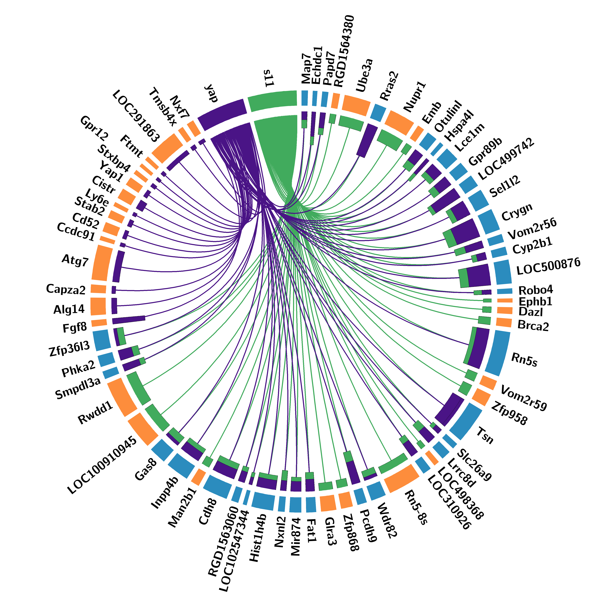
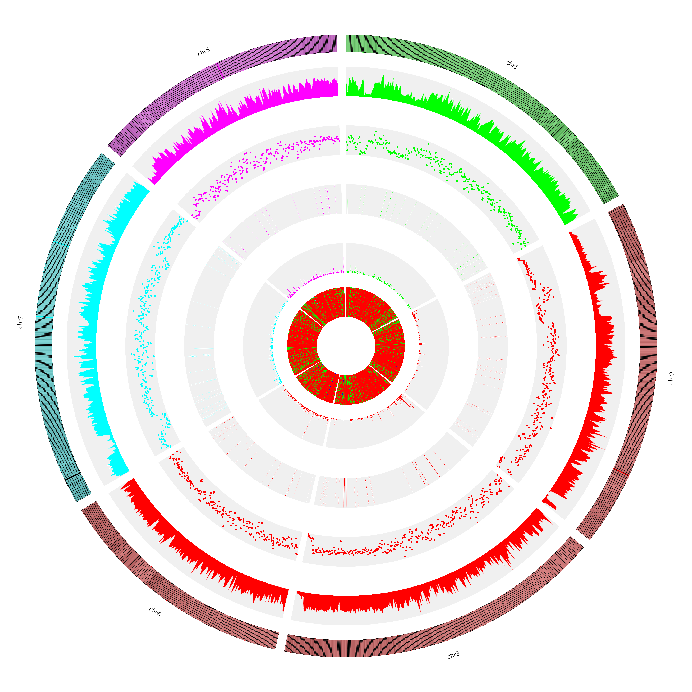
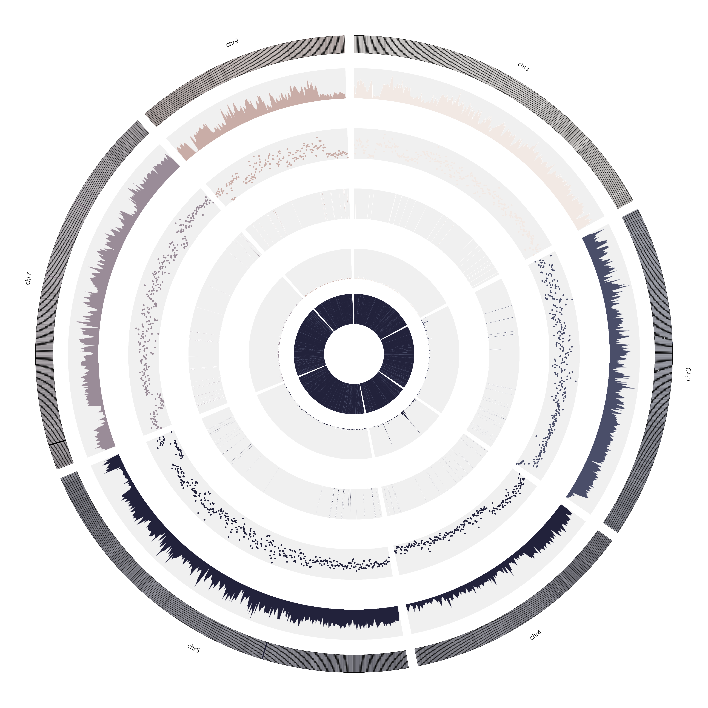
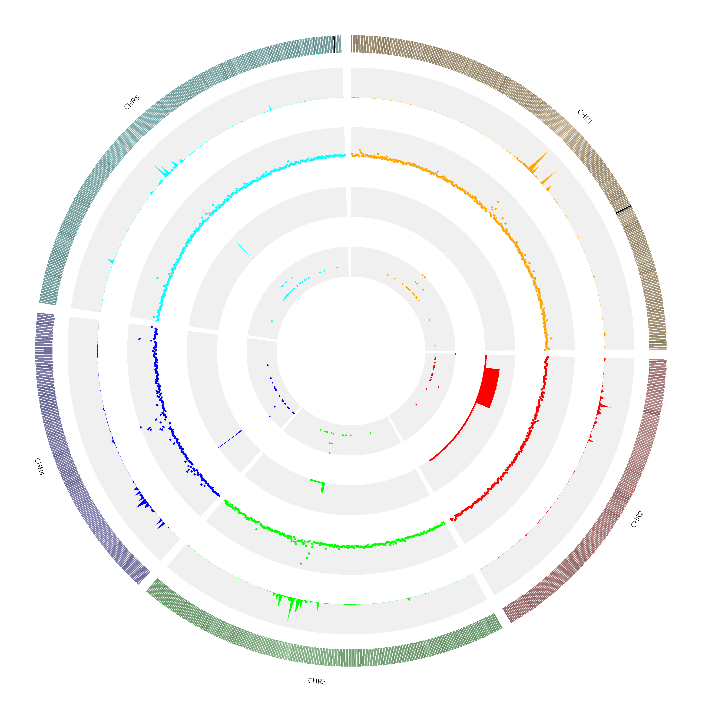

## Circos-Pipeline
#### This Pipeline was using to Viz the genome variation or others like chord diagram plot for GO and KEGG enrichment analysis result. If you found any bug or any other Viz which you want to add in this pipeline, please feel free to let [me](czheluo@gmail.com) know.

### Calling Variation (SSR、CNV、SV、GENEs、SNP、Indels)

> running code

```linux
$  perl circos.pipeline.pl -chrlist ref.list -gff ref.gff -outdir ./ -paramlist circos.list
```


### demo1 chord diagram 


### v1


### v2 


### v3


### v4


